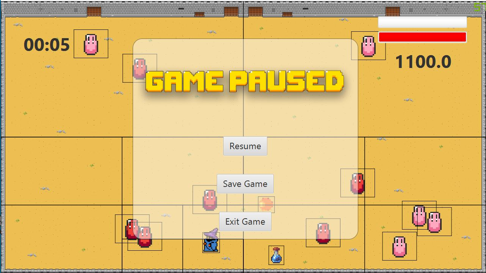

# mage-arena
A JavaFX videogame based on an arena battle with a retro-style where a mage fights to survive an endless wave of slimes with its spells

## Getting Started

### Run it

To run the application, clone the repository and execute the src/ui/Main.java file

### Usage

To have full access to the app

1. Register a user with the name Admin and any password
2. Log in with the previously created user
3. Play a match
  - Move with the W, A, S, D keys +
  - Click on the screen to attack with a spell
  - Press the ESC key to pause the game
  - Press the ESC key to unpause the game
  - Save the match on the pause menu
4. Access the rest of the app

### Explanation Video

In this video you can find the explanation of the whole project. 
[Video](https://youtu.be/nyuW5ttxnlA)

## Features

### Performance Optimization

The application uses a [Quadtree](https://en.wikipedia.org/wiki/Quadtree), a tree data structure, to optimize the amount of collision to be calculated. 
This greatly improves the performance of the game, due to the fact that the amount of collisions to be checked is 
(Number of spells * Number of mobs), this means that using a quadtree, its only necessary to check the mobs that are 
in the same quadtree of a given spell, avoiding the need to take into account the rest of mobs in the whole game.

An important characteristic of a quadtree is that it has a maximum capacity of elements that it can contain, and 
when a new entity is going to be inserted when the structure is full, it subdivides into four different quadtrees. 
In this application, the maximum depth is of 3, in which any quadtree having this depth will have an unrestricted capacity, 
so it doesn't subdivide any further.

## Directory

### Requirements

The Functional and nonfunctional Requirements can be found in here [here](https://github.com/Gallo9923/mage-arena/blob/master/docs/Entregas/Entrega%20Final%20Proyecto.pdf)

### Class Diagram

The class diagram of the project can be found in [here](https://github.com/Gallo9923/mage-arena/blob/master/docs/Class%20Diagram/Class_Diagram.jpg)

### Unit Testing

The design of the unit testing can be found in [here](https://github.com/Gallo9923/mage-arena/blob/master/docs/Entregas/Unit%20Testing.pdf)

## Authors

* **Christian Gallo** - [Gallo9923](https://github.com/Gallo9923)
